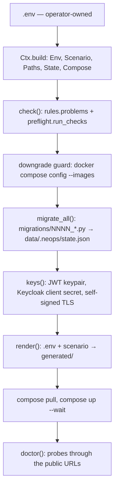

# AGENTS.md

Guidance for AI coding agents working in this repository. Humans: `README.md` is the operator
manual and `docs/` the full documentation; this file is about *changing* the repo, not running a
deployment.

## What this repository is

The customer-installed deployment of the Neops 2.0 stack: the Compose files that define it, plus
`neops_compose/`, an operator CLI invoked as `./neops`. Customers clone this repo onto their host,
fill in `.env`, and run `./neops install`; from then on every upgrade is `git pull && ./neops up`
against a **live installation with their data in it**. That is the constraint behind most of the
rules below — see [Backward compatibility](#backward-compatibility-is-the-hard-rule).

`.env` is the single source of truth. It is operator-owned and gitignored; the CLI reads it,
validates it, derives everything else from it, and only ever writes it through `./neops secrets`,
`./neops rotate` and migrations.

## Commands

```bash
make check                       # lint + unit tests + compose-config gate — what CI runs
make lint                        # ruff check + ruff format --check
make format                      # ruff format
make test                        # uv run pytest -q  (tests/unit only)
make compose-config              # docker compose config for every examples/*.env
make e2e SCENARIO=traefik-tls-selfsigned   # real containers; needs docker + quay.io login

uv run pytest tests/unit/test_render.py            # one file
uv run pytest tests/unit/test_rules.py -k monitor  # one test
```

`./neops <command>` drives a real deployment from this checkout (`uv run neops`). Safe to run
while developing: `check`, `status`, `render --diff`, `migrate --dry-run`. `mkdocs.yml` is
generated from `mkdocs_custom.yml` — never edit it by hand.

## Architecture

One command, `./neops up`, is the whole design in order:



- **`neops_compose/cli.py`** is argparse plus a `match` over commands; every command is a function
  in `workflow.py` or a module beside it. Every exception the package defines is listed in `ERRORS`
  and printed as `error: ...` rather than a traceback, so a new exception type must be added there.
- **`context.py`** builds the one `Ctx` a command gets. Note it derives `Scenario` **once**.
- **`scenario.py`** turns `COMPOSE_FILE` into a `Scenario`: which overlay files are active, hence
  which proxy, TLS mode, IdP and extras this deployment has. Nearly everything downstream branches
  on the `Scenario`, not on raw env keys.
- **`rules.py`** holds pure `.env`-validation knowledge (required keys, secret strength, legal
  overlay combinations, URL/port/path rules); **`preflight.py`** adds host-level checks (kernel
  settings, disk, ports, images) and formats the report; **`doctor.py`** probes a *running* stack
  through its public URLs. Three different moments — do not merge them.
- **`urls.py` / `routes.py` / `traefik_model.py`** are the routing model: `PublicUrl`, where each
  service sits, and the Traefik static/dynamic configuration built from it. `traefik_model.py`
  decides; `render.py` only serialises.
- **`render.py`** writes `generated/` from `.env` + `Scenario`, deterministically, overwriting in
  place and deleting whatever the current scenario no longer needs. `generated/` is gitignored,
  never hand-edited, and reproducible at any time with `./neops render`.
- **`migrate.py` + `migrations/`** move an *installation* forward; see `migrations/README.md`.
- **`state.py`** owns `data/.neops/state.json`: applied migrations, last start, CLI version.
- Secrets live in `.env` and `data/secrets/`: `passwords.py` mints the `.env` ones, `secrets.py`
  the key material, `token.py` the engine's CMS API key, `rotate.py` replaces any of them in the
  right order against a running stack.

Compose layout: `compose.yaml` is the stack, image pins live in its `x-versions` anchors, and each
`compose.<name>.yaml` is an overlay the operator selects through `COMPOSE_FILE`. Overlays are
listed in `scenario.OVERLAYS`; adding a file without adding it there makes `check` reject it as an
unknown file.

## Backward compatibility is the hard rule

**Every release must upgrade an installation of the previous release with `git pull && ./neops up`
and nothing else.** No manual file edits, no "run this one command first", no reinstall. Customer
data and a filled `.env` are on the other side of that upgrade.

Two consequences, both easy to get wrong:

### 1. A change that needs an existing installation touched ships with a migration

Renamed `.env` key, moved data directory, new directory a bind mount needs, ownership fix, a value
that must be derived once — all of it belongs in a numbered migration under `migrations/`, applied
once and recorded in `data/.neops/state.json`. Read `migrations/README.md` before writing one; the
rules that bite are that module scope must be import-pure, that a non-idempotent migration which
crashes half-way leaves a `.failed` marker the operator must clear by hand, and that a shipped
migration is never edited — you add a new one.

Never require the operator to edit `.env` by hand as part of an upgrade. If the new release needs a
key the old one did not have, either give it a default in code or set it in a migration.

### 2. Everything that runs *before* migrations must tolerate an un-migrated installation

Look at the order in the diagram: `check()` and the downgrade guard run **before** `migrate_all()`,
and the downgrade guard runs `docker compose config`. So on the very first `./neops up` after a
`git pull`, the new release's validation and the new release's Compose files are applied to the
**old** release's `.env` and the **old** release's `generated/`. Anything the new release requires
but the previous one never produced fails there, before the migration that would have fixed it ever
runs. A migration cannot dig you out of this.

Concretely, in new code:

- **No Compose file may `extends:` or `include:` a path under `generated/`.** Those are resolved at
  config-load time and have no optional form, so a fragment the previous release never rendered
  breaks `up`, and equally `status`, `down`, `logs` and `ps`. A *bind mount* of a generated file is
  fine — Docker only needs it when the container starts.
- **A generated file used as `env_file:` must be `required: false`** unless it has existed since the
  first release. `tests/unit/test_compose_files.py` enforces this and carries the list of
  files that may be required.
- **An overlay's filename is public API.** `COMPOSE_FILE` in a customer's `.env` names those files
  literally, and `rules._overlay_problems` fails with `COMPOSE_FILE names X, which does not exist`
  before `migrate_all()` could rewrite the key. Renaming or deleting a shipped `compose.*.yaml`
  therefore breaks every existing installation that used it; keep the old name working.
- **A new rule in `rules.py` or `preflight.py` must not FAIL on the previous release's `.env`** when
  a migration is what brings that `.env` up to date. Preflight runs first; it would refuse the
  upgrade before the migration could run. Warn, or accept both shapes.
- **A migration that rewrites `COMPOSE_FILE` is not seen by the rest of that same run**: `Ctx`
  derives `Scenario` once, at build time, so `keys()` and `render()` still use the pre-migration
  scenario (Docker itself re-reads `.env`, so only the Python side is stale).
- Downgrades are refused on purpose (Django migrations are not reversible). Backward compatibility
  means *forward* upgrade paths, not reversible releases.

`./neops render` is the one command that is safe to run at any point during an upgrade: it reads
`.env` and writes nothing outside `generated/`. Inside `generated/` it is authoritative — it
overwrites what it owns and deletes everything else, including a file an earlier release rendered
and anything hand-added there. On a running stack Traefik watches `generated/traefik/dynamic.yml`,
so a render applies the new routing to the live proxy immediately.

## Conventions

- Validation knowledge belongs in `rules.py`, not spread across call sites; a message names the
  `.env` key and what to do about it, because an operator reads it, not a developer.
- Anything the operator can misconfigure gets a test in `tests/unit/`, and anything that changes the
  shape of the Compose merge gets covered by `tests/compose_config_check.py`, which renders and runs
  `docker compose config` for every `examples/*.env`. A new scenario means a new example there.
- Examples ship secret-shaped keys blank; `rules.ALL_SECRET_KEYS` is the single list the example
  tests and the config gate both fill from.
- Comments explain *why*. The existing files are the style reference: sparse, and where they exist
  they justify a decision rather than narrate the code.
- Every PR needs exactly one release-note label (`pr-breaking-change`, `pr-new-feature`, `pr-bugfix`,
  `pr-security`, `pr-other`) — CI enforces it.
